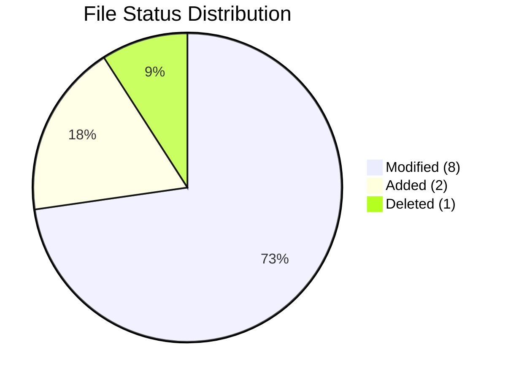
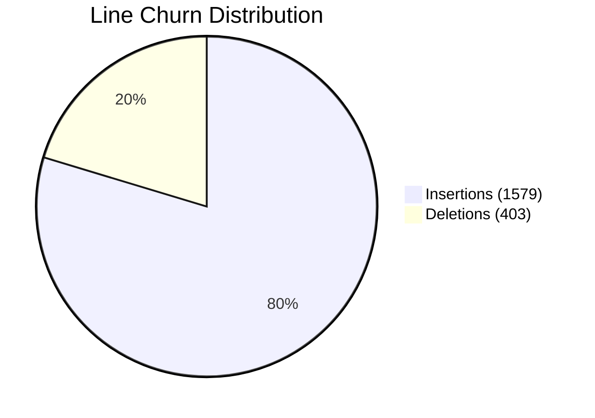
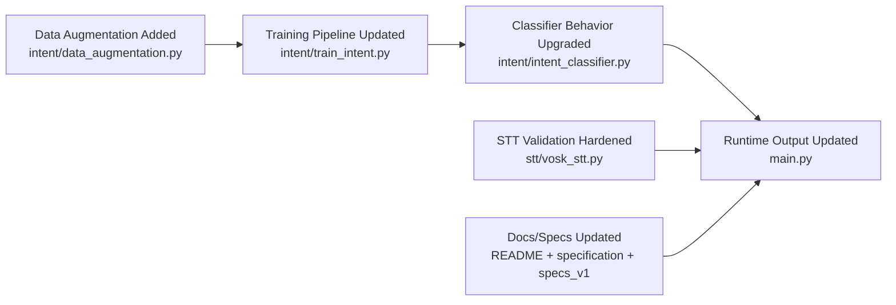

# Patch v2 Report

## Commit Covered
- Hash: `5235a4e7a1279ee62b830b312318e1239db9fea1`
- Title: `feat: upgrade intent pipeline and STT robustness`
- Date: 2026-04-18

## Quick Delta (vs previous commit)
- Files changed: **11**
- Added: **2** (`intent/data_augmentation.py`, `test_augmentation.py`)
- Modified: **8**
- Deleted: **1** (`stt/vosk_model/.gitkeep`)
- Line churn: **+1579 / -403**

## What Was Added
- `intent/data_augmentation.py` (new, 865 lines)
  - Structured template-based dataset generation for all intents.
  - Slot expansion (`distance`, `angle`, `chapter`, `page`, topic values).
  - Synonym expansion, NAVIGATE clause permutation, and ASR-like noise injection.
  - Exact + near-duplicate filtering (token and bigram similarity checks).
  - Balanced dataset builder with stats (`build_generated_dataset`, `generate_dataset`).
  - Optional dataset export to `intent/generated_dataset.json`.

- `test_augmentation.py` (new, 56 lines)
  - Inspection script to print per-intent sample counts, duplicate rate, and noise examples.

- `specs_v1.md` (new content, 252 lines)
  - Full upgrade specification for augmentation + hybrid intent decision logic.

## What Changed
- `intent/train_intent.py`
  - Replaced static hardcoded examples with generated training data from augmentation module.
  - Target scale shifted from small fixed set to large balanced set (2000 samples/intent).
  - Added evaluation output: confusion matrix, per-intent accuracy, unknown-rate metrics, ambiguous probe checks.
  - Saves `vectorizer.joblib` and `classifier.joblib` after training on generated data.

- `intent/intent_classifier.py`
  - Output expanded from `{intent, confidence}` to include `margin`, `top3`, `unknown_reason`, `rule_boosts`.
  - Added configurable thresholds via env vars:
    - `INTENT_CONFIDENCE_THRESHOLD` (default `0.58`)
    - `INTENT_MARGIN_THRESHOLD` (default `0.12`)
  - Added additive rule-boosting for NAVIGATE/RAG_QUERY signals before final ranking.
  - Added margin gating (`top1 - top2`) and confidence fallback to UNKNOWN.
  - Added relaxed confidence handling for RAG_QUERY when strong/explicit RAG rule triggers are present.

- `main.py`
  - Now propagates and prints classifier diagnostics (`margin`, `unknown_reason`) in console output.
  - RAG pre-route now sets `margin=1.0` and `unknown_reason=None` for consistent output shape.

- `stt/vosk_stt.py`
  - Model path can be overridden with `VOSK_MODEL_PATH`.
  - Added model-directory validation (`am/`, `conf/`, `graph/` required).
  - Added clearer load errors for invalid/incomplete/corrupted model folders.

- `README.md` and `specification.md`
  - Updated docs to reflect generated dataset size, new classifier outputs, and evaluation reporting.
  - Updated project structure to include augmentation/testing artifacts.

- `.gitignore`
  - Added `intent/generated_dataset.json` to ignored artifacts.

- `stt/vosk_model/.gitkeep`
  - Removed from repository.

## Component Impact (high-level)
- Intent subsystem: **major rewrite/expansion** (`intent/*`)
- STT loader: **robustness hardening** (`stt/vosk_stt.py`)
- App wiring: **diagnostic visibility upgrade** (`main.py`)
- Docs/specs: **aligned with new runtime behavior**

## Files Changed (exact)
- M `.gitignore`
- M `README.md`
- A `intent/data_augmentation.py`
- M `intent/intent_classifier.py`
- M `intent/train_intent.py`
- M `main.py`
- M `specification.md`
- M `specs_v1.md`
- D `stt/vosk_model/.gitkeep`
- M `stt/vosk_stt.py`
- A `test_augmentation.py`
